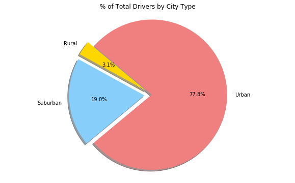

## Unit 5 | Assignment - The Power of Plots

## Background

## Option 1: Pyber


```python
import pandas as pd
import numpy as np
import matplotlib.pyplot as plt
import seaborn as sns
```


```python
file1 = ('raw_data/city_data.csv')

pyber_df1 = pd.read_csv(file1)

pyber_df1.head()
```


<div>
<style scoped>
    .dataframe tbody tr th:only-of-type {
        vertical-align: middle;
    }

    .dataframe tbody tr th {
        vertical-align: top;
    }

    .dataframe thead th {
        text-align: right;
    }
</style>
<table border="1" class="dataframe">
  <thead>
    <tr style="text-align: right;">
      <th></th>
      <th>city</th>
      <th>driver_count</th>
      <th>type</th>
    </tr>
  </thead>
  <tbody>
    <tr>
      <th>0</th>
      <td>Kelseyland</td>
      <td>63</td>
      <td>Urban</td>
    </tr>
    <tr>
      <th>1</th>
      <td>Nguyenbury</td>
      <td>8</td>
      <td>Urban</td>
    </tr>
    <tr>
      <th>2</th>
      <td>East Douglas</td>
      <td>12</td>
      <td>Urban</td>
    </tr>
    <tr>
      <th>3</th>
      <td>West Dawnfurt</td>
      <td>34</td>
      <td>Urban</td>
    </tr>
    <tr>
      <th>4</th>
      <td>Rodriguezburgh</td>
      <td>52</td>
      <td>Urban</td>
    </tr>
  </tbody>
</table>
</div>


```python
#Get rid off duplicate cities
pyber_df1 = pyber_df1.groupby('city').agg({'driver_count': sum, 'type':'first' }).reset_index()
pyber_df1.head()

```


<div>
<style scoped>
    .dataframe tbody tr th:only-of-type {
        vertical-align: middle;
    }

    .dataframe tbody tr th {
        vertical-align: top;
    }

    .dataframe thead th {
        text-align: right;
    }
</style>
<table border="1" class="dataframe">
  <thead>
    <tr style="text-align: right;">
      <th></th>
      <th>city</th>
      <th>driver_count</th>
      <th>type</th>
    </tr>
  </thead>
  <tbody>
    <tr>
      <th>0</th>
      <td>Alvarezhaven</td>
      <td>21</td>
      <td>Urban</td>
    </tr>
    <tr>
      <th>1</th>
      <td>Alyssaberg</td>
      <td>67</td>
      <td>Urban</td>
    </tr>
    <tr>
      <th>2</th>
      <td>Anitamouth</td>
      <td>16</td>
      <td>Suburban</td>
    </tr>
    <tr>
      <th>3</th>
      <td>Antoniomouth</td>
      <td>21</td>
      <td>Urban</td>
    </tr>
    <tr>
      <th>4</th>
      <td>Aprilchester</td>
      <td>49</td>
      <td>Urban</td>
    </tr>
  </tbody>
</table>
</div>


```python
file2 = ('raw_data/ride_data.csv')
pyber_df2 = pd.read_csv(file2)

pyber_df2.head()
```


<div>
<style scoped>
    .dataframe tbody tr th:only-of-type {
        vertical-align: middle;
    }

    .dataframe tbody tr th {
        vertical-align: top;
    }

    .dataframe thead th {
        text-align: right;
    }
</style>
<table border="1" class="dataframe">
  <thead>
    <tr style="text-align: right;">
      <th></th>
      <th>city</th>
      <th>date</th>
      <th>fare</th>
      <th>ride_id</th>
    </tr>
  </thead>
  <tbody>
    <tr>
      <th>0</th>
      <td>Sarabury</td>
      <td>2016-01-16 13:49:27</td>
      <td>38.35</td>
      <td>5403689035038</td>
    </tr>
    <tr>
      <th>1</th>
      <td>South Roy</td>
      <td>2016-01-02 18:42:34</td>
      <td>17.49</td>
      <td>4036272335942</td>
    </tr>
    <tr>
      <th>2</th>
      <td>Wiseborough</td>
      <td>2016-01-21 17:35:29</td>
      <td>44.18</td>
      <td>3645042422587</td>
    </tr>
    <tr>
      <th>3</th>
      <td>Spencertown</td>
      <td>2016-07-31 14:53:22</td>
      <td>6.87</td>
      <td>2242596575892</td>
    </tr>
    <tr>
      <th>4</th>
      <td>Nguyenbury</td>
      <td>2016-07-09 04:42:44</td>
      <td>6.28</td>
      <td>1543057793673</td>
    </tr>
  </tbody>
</table>
</div>


```python
pyber_df = pd.merge(pyber_df1,pyber_df2 ,on='city')
```


```python
pyber_df.head()
```


<div>
<style scoped>
    .dataframe tbody tr th:only-of-type {
        vertical-align: middle;
    }

    .dataframe tbody tr th {
        vertical-align: top;
    }

    .dataframe thead th {
        text-align: right;
    }
</style>
<table border="1" class="dataframe">
  <thead>
    <tr style="text-align: right;">
      <th></th>
      <th>city</th>
      <th>driver_count</th>
      <th>type</th>
      <th>date</th>
      <th>fare</th>
      <th>ride_id</th>
    </tr>
  </thead>
  <tbody>
    <tr>
      <th>0</th>
      <td>Alvarezhaven</td>
      <td>21</td>
      <td>Urban</td>
      <td>2016-04-18 20:51:29</td>
      <td>31.93</td>
      <td>4267015736324</td>
    </tr>
    <tr>
      <th>1</th>
      <td>Alvarezhaven</td>
      <td>21</td>
      <td>Urban</td>
      <td>2016-08-01 00:39:48</td>
      <td>6.42</td>
      <td>8394540350728</td>
    </tr>
    <tr>
      <th>2</th>
      <td>Alvarezhaven</td>
      <td>21</td>
      <td>Urban</td>
      <td>2016-09-01 22:57:12</td>
      <td>18.09</td>
      <td>1197329964911</td>
    </tr>
    <tr>
      <th>3</th>
      <td>Alvarezhaven</td>
      <td>21</td>
      <td>Urban</td>
      <td>2016-08-18 07:12:06</td>
      <td>20.74</td>
      <td>357421158941</td>
    </tr>
    <tr>
      <th>4</th>
      <td>Alvarezhaven</td>
      <td>21</td>
      <td>Urban</td>
      <td>2016-04-04 23:45:50</td>
      <td>14.25</td>
      <td>6431434271355</td>
    </tr>
  </tbody>
</table>
</div>


```python

pyber_df = pyber_df[['city', 'date', 'fare', 'ride_id', 'driver_count', 'type']]
pyber_df.head()
```


<div>
<style scoped>
    .dataframe tbody tr th:only-of-type {
        vertical-align: middle;
    }

    .dataframe tbody tr th {
        vertical-align: top;
    }

    .dataframe thead th {
        text-align: right;
    }
</style>
<table border="1" class="dataframe">
  <thead>
    <tr style="text-align: right;">
      <th></th>
      <th>city</th>
      <th>date</th>
      <th>fare</th>
      <th>ride_id</th>
      <th>driver_count</th>
      <th>type</th>
    </tr>
  </thead>
  <tbody>
    <tr>
      <th>0</th>
      <td>Alvarezhaven</td>
      <td>2016-04-18 20:51:29</td>
      <td>31.93</td>
      <td>4267015736324</td>
      <td>21</td>
      <td>Urban</td>
    </tr>
    <tr>
      <th>1</th>
      <td>Alvarezhaven</td>
      <td>2016-08-01 00:39:48</td>
      <td>6.42</td>
      <td>8394540350728</td>
      <td>21</td>
      <td>Urban</td>
    </tr>
    <tr>
      <th>2</th>
      <td>Alvarezhaven</td>
      <td>2016-09-01 22:57:12</td>
      <td>18.09</td>
      <td>1197329964911</td>
      <td>21</td>
      <td>Urban</td>
    </tr>
    <tr>
      <th>3</th>
      <td>Alvarezhaven</td>
      <td>2016-08-18 07:12:06</td>
      <td>20.74</td>
      <td>357421158941</td>
      <td>21</td>
      <td>Urban</td>
    </tr>
    <tr>
      <th>4</th>
      <td>Alvarezhaven</td>
      <td>2016-04-04 23:45:50</td>
      <td>14.25</td>
      <td>6431434271355</td>
      <td>21</td>
      <td>Urban</td>
    </tr>
  </tbody>
</table>
</div>


```python
pyber_df_count = pyber_df[['city',  'driver_count', 'type', 'fare']].groupby(['city', 'driver_count', 'type']).agg(['count','mean'])
pyber_df_count.columns = ['total_number_of_rides', 'average_fare']
pyber_df_count['average_fare'] = pyber_df_count['average_fare'].map("{:.2f}".format)
pyber_df_count.reset_index().head()
```


<div>
<style scoped>
    .dataframe tbody tr th:only-of-type {
        vertical-align: middle;
    }

    .dataframe tbody tr th {
        vertical-align: top;
    }

    .dataframe thead th {
        text-align: right;
    }
</style>
<table border="1" class="dataframe">
  <thead>
    <tr style="text-align: right;">
      <th></th>
      <th>city</th>
      <th>driver_count</th>
      <th>type</th>
      <th>total_number_of_rides</th>
      <th>average_fare</th>
    </tr>
  </thead>
  <tbody>
    <tr>
      <th>0</th>
      <td>Alvarezhaven</td>
      <td>21</td>
      <td>Urban</td>
      <td>31</td>
      <td>23.93</td>
    </tr>
    <tr>
      <th>1</th>
      <td>Alyssaberg</td>
      <td>67</td>
      <td>Urban</td>
      <td>26</td>
      <td>20.61</td>
    </tr>
    <tr>
      <th>2</th>
      <td>Anitamouth</td>
      <td>16</td>
      <td>Suburban</td>
      <td>9</td>
      <td>37.32</td>
    </tr>
    <tr>
      <th>3</th>
      <td>Antoniomouth</td>
      <td>21</td>
      <td>Urban</td>
      <td>22</td>
      <td>23.62</td>
    </tr>
    <tr>
      <th>4</th>
      <td>Aprilchester</td>
      <td>49</td>
      <td>Urban</td>
      <td>19</td>
      <td>21.98</td>
    </tr>
  </tbody>
</table>
</div>


```python
pyber_df_count = pyber_df_count.reset_index()
```

* Average Fare ($) Per City
* Total Number of Rides Per City
* Total Number of Drivers Per City
* City Type (Urban, Suburban, Rural)


```python
city_types = pyber_df['type'].unique()
city_types
```


    array(['Urban', 'Suburban', 'Rural'], dtype=object)


```python
x_axis = pd.to_numeric(pyber_df_count['total_number_of_rides'])
y_axis = pd.to_numeric(pyber_df_count['average_fare'])
s_value = pd.to_numeric(pyber_df_count['driver_count'])*5 
colors={'Urban':'gold', 'Suburban':'lightskyblue', 'Rural':'lightcoral'}
colors1 = pyber_df_count['type'].apply(lambda x: colors[x]).values
```


```python
lgnd = plt.scatter(x_axis, y_axis, s=s_value, facecolor=colors1, edgecolors='black',alpha=0.75,label='')
plt.title('Pyber Ride Sharing Data(2016)')
fig_size = plt.rcParams["figure.figsize"] = [10,6]
fig_size[0] = 10
fig_size[1] = 6
plt.xlabel('Total Number of Rides (Per City)')
plt.ylabel('Average Fare ($)')
#plt.rcParams['figure.figsize'] = fig_size
gold_patch = plt.scatter([],[], marker="o", alpha=0.9,facecolor='gold', edgecolors='black', label='Urban')
blue_patch = plt.scatter([],[], marker="o", alpha=0.9,facecolor='lightskyblue',edgecolors='black',label='Suburban')
coral_patch = plt.scatter([],[], marker="o", alpha=0.9,facecolor='lightcoral', edgecolors='black',label='Rural')
plt.legend(handles=[gold_patch,blue_patch,coral_patch],title="City Types")
plt.show()   
    
```


## % of Total Fares by City Type


```python

total_fares_by_citytype = pyber_df[['fare', 'type']].groupby(['type']).sum()
percentage_total_fares_by_citytype = round((total_fares_by_citytype['fare']/pyber_df['fare'].sum())*100, 2)
total_fares_by_citytype
percentage_total_fares_by_citytype

```


    type
    Rural        6.68
    Suburban    30.35
    Urban       62.97
    Name: fare, dtype: float64


```python
# Labels for the sections of our pie chart
labels = ['Rural', 'Suburban', 'Urban']

# The values of each section of the pie chart
persentage = percentage_total_fares_by_citytype.values

persentage
# The colors of each section of the pie chart
colors = ["gold", "lightskyblue" ,"lightcoral"]

# Tells matplotlib to seperate the "Python" section from the others
explode = (0.1, 0.1, 0)

```


```python
plt.pie(persentage, explode=explode, labels=labels, colors=colors,
        autopct="%1.1f%%", shadow=True, startangle=140)
plt.title('% of Total Fares by City Type')
plt.axis("equal")
plt.show()
```


## % of Total Rides by City Type


```python
#total_rides_by_citytype = pyber_df[['type', 'fare']].groupby(['type']).count()
total_rides_by_citytype = pyber_df[['type', 'ride_id']].groupby(['type']).count()
total_rides_by_citytype
```


<div>
<style scoped>
    .dataframe tbody tr th:only-of-type {
        vertical-align: middle;
    }

    .dataframe tbody tr th {
        vertical-align: top;
    }

    .dataframe thead th {
        text-align: right;
    }
</style>
<table border="1" class="dataframe">
  <thead>
    <tr style="text-align: right;">
      <th></th>
      <th>ride_id</th>
    </tr>
    <tr>
      <th>type</th>
      <th></th>
    </tr>
  </thead>
  <tbody>
    <tr>
      <th>Rural</th>
      <td>125</td>
    </tr>
    <tr>
      <th>Suburban</th>
      <td>625</td>
    </tr>
    <tr>
      <th>Urban</th>
      <td>1625</td>
    </tr>
  </tbody>
</table>
</div>


```python
total_rides_by_citytype.columns = ['total rides by city type']
```


```python
percentage_of_total_rides_by_citytype = round(total_rides_by_citytype['total rides by city type']/pyber_df['fare'].count()*100, 2)
percentage_of_total_rides_by_citytype    
```


    type
    Rural        5.26
    Suburban    26.32
    Urban       68.42
    Name: total rides by city type, dtype: float64


```python

# Labels for the sections of our pie chart
labels = ['Rural', 'Suburban', 'Urban']

# The values of each section of the pie chart
persentage = percentage_of_total_rides_by_citytype.values

persentage
# The colors of each section of the pie chart
colors = ["gold", "lightskyblue" ,"lightcoral"]

# Tells matplotlib to seperate the "Python" section from the others
explode = (0.1, 0.1, 0)

plt.pie(persentage, explode=explode, labels=labels, colors=colors,
        autopct="%1.1f%%", shadow=True, startangle=140)
plt.title('% of Total Rides by City Type')
plt.axis("equal")
plt.show()
```


## % of Total Drivers by City Type


```python

total_drivers_by_citytype = pyber_df_count[['driver_count', 'type']].groupby(['type']).sum()
print(total_drivers_by_citytype)

percentage_total_drivers_by_citytype = round(total_drivers_by_citytype['driver_count']/pyber_df_count['driver_count'].sum()*100, 2)
```

              driver_count
    type                  
    Rural              104
    Suburban           638
    Urban             2607


```python
# Labels for the sections of our pie chart
labels = ['Rural', 'Suburban', 'Urban']

# The values of each section of the pie chart
persentage = percentage_total_drivers_by_citytype.values

persentage
# The colors of each section of the pie chart
colors = ["gold", "lightskyblue" ,"lightcoral"]

# Tells matplotlib to seperate the "Python" section from the others
explode = (0.1, 0.1, 0)

plt.pie(persentage, explode=explode, labels=labels, colors=colors,
        autopct="%1.1f%%", shadow=True, startangle=140)
plt.title('% of Total Drivers by City Type')
plt.axis("equal")
plt.show()
```





* You must include a written description of three observable trends based on the data.

1.Total number of drivers in urban area is majority (77.8%)
2.Total rides in urban area is also high (68.4%)
3.Correspondingly totalfares in this type also very high


```python

```
